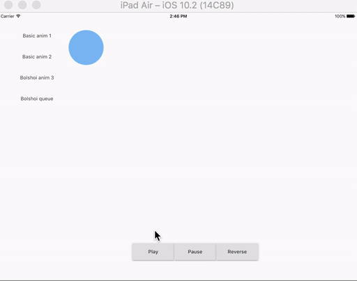

# Bolshoi

Experimental animation helpers for [Flutter](http://flutter.io) UIs.
Bolshoi simplifies nested sequential or parallel animations.

## Installation

Bolshoi depends on Flutter SDK

### Usage



cf. [demo](https://github.com/rxlabz/bolshoi/tree/master/example/bolshoi_demo)


#### AnimationGroup : Parallel properties animations

```dart
class AnimScene2State extends AnimSceneState<AnimScene2> {
  /*Tween tween;
  ColorTween colorTween;*/
  AnimationGroup animations;
  Color color;

  final Color c1 = Colors.blue[300];
  final Color c2 = Colors.green[300];

  void initState() {
    color = c1;
    animations = new AnimationGroup([
      new PropertyAnimation(kDuration_ms,
          vsync: this,
          curve: Curves.fastOutSlowIn,
          tween: new Tween<double>(begin: 100.0, end: 500.0),
          animator: (double v) => setState(() => posLeft = v)),
      new PropertyAnimation(kDuration_ms,
          vsync: this,
          curve: Curves.fastOutSlowIn,
          tween: new ColorTween(begin: c1, end: c2),
          animator: (Color c) => setState(() => color = c))
    ]);
    animations.forward();
    super.initState();
  }

  @override
  Widget build(BuildContext context) {
    return new Container(
        child: new Stack(children: [
      new Positioned(
          left: posLeft,
          top: 50.0,
          child: new SizedBox(
              width: 100.0,
              height: 100.0,
              child: new DecoratedBox(
                  decoration:
                      new BoxDecoration(shape: BoxShape.circle, color: color))))
    ]));
  }
}
```

#### Animation : Sequence properties animations

```dart
class AnimScene3State extends AnimSceneState<AnimScene3> {
  AnimationSequence animations;
  Color color;

  final Color c1 = Colors.blue[300];
  final Color c2 = Colors.green[300];

  void initState() {
    color = c1;
    animations = new AnimationSequence.from([
      new PropertyAnimation(kDuration_ms,
          vsync: this,
          curve: Curves.fastOutSlowIn,
          tween: new Tween<double>(begin: 100.0, end: 500.0),
          animator: (double v) => setState(() => posLeft = v)),
      new PropertyAnimation(kDuration_ms,
          vsync: this,
          curve: Curves.fastOutSlowIn,
          tween: new ColorTween(begin: c1, end: c2),
          animator: (Color c) => setState(() => color = c))
    ]);
    super.initState();
  }

  @override
  Widget build(BuildContext context) {
    return new Container(
        child: new Stack(children: [
      new Positioned(
          left: posLeft,
          top: 50.0,
          child: new SizedBox(
              width: 100.0,
              height: 100.0,
              child: new DecoratedBox(
                  decoration:
                      new BoxDecoration(shape: BoxShape.circle, color: color))))
    ]));
  }
  
  animations.forward();
}

```

